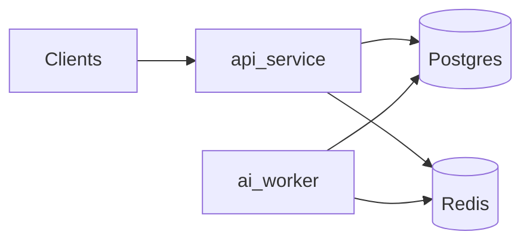

# Architecture — Phase 4 Redis caching

## Service boundaries

- **api-service** — FastAPI: thin routes, repositories own SQL/ORM, services orchestrate intake and reads. **`POST /tickets`** creates a ticket in `pending_embedding` and returns quickly; **no AI provider calls** on the API path.
- **ai-worker** — Polls `pending_embedding` tickets; provider interface defaults to **`mock`**. Optional **`openai`** (`text-embedding-3-small`, `gpt-4.1-mini`) requires `OPENAI_API_KEY` from environment only.
- **shared-contracts** — Taxonomies, `ClassificationOutput`, observability DTOs, and **cache key builders + JSON cache DTOs** (`shared_contracts/cache_keys.py`, `cache_dtos.py`). No Redis client in this package.

## Data authority and cache

- **Postgres** is authoritative for tickets, embeddings, routing decisions, audit events, and **draft suggestions**.
- **Redis** is non-authoritative: readiness probe + **fail-open read cache** (Phase 4). Cache miss or Redis error always falls back to Postgres.
- **pgvector** remains the similarity engine; Redis caches **similarity result sets** by query/filter hash (TTL 5m), not raw authoritative embeddings.
- Cache namespace: `ai-ticket:v1:...` (see `shared_contracts/cache_keys.py`).

### Cache-aside (api-service)

| Cached read | Key family | Default TTL |
|-------------|------------|-------------|
| Ticket status | `ticket:{id}:status` | 60s |
| Latest routing | `ticket:{id}:routing:latest` | 10m |
| Latest draft | `ticket:{id}:draft:latest` | 5m |
| Events summary (no payloads) | `ticket:{id}:events` | 30s |
| Similarity results | `similarity:{model}:{dim}:{query_hash}:{filters_hash}` | 5m |

**Invalidation:** ai-worker and api-service mutation paths **delete** ticket read-model keys after durable Postgres writes. Similarity keys expire by TTL only.

**Not cached:** full `GET /tickets/{id}` ticket body; raw embedding vectors as primary cache strategy.

## HTTP surface (api-service)

| Method | Path | Notes |
|--------|------|--------|
| `POST` | `/tickets` | Intake → `pending_embedding` |
| `GET` | `/tickets/{id}` | Ticket read |
| `GET` | `/tickets/{id}/status`, `/events`, `/routing-decision`, `/draft-suggestion` | Status, audit, routing, latest draft |
| `POST` | `/tickets/similar` | Caller-provided query vector only |
| `POST` | `/tickets/{id}/embeddings/test` | **Phase 2 local scaffolding only** — not production embedding path |

Production embeddings are written by **ai-worker** through `EmbeddingService` + repositories.

## Worker AI pipeline

1. **Embedding** — OpenAI `text-embedding-3-small` (1536) or mock; skip regeneration when `source_text_hash` unchanged; store model name and dimension on every row.
2. **Classification** — Structured JSON; persist `category`, `team`, `priority`, `escalation` routing rows. Tiered confidence: &lt;0.60 → unknown/triage; 0.60–0.79 → human review; routing confidence &lt;0.80 → triage.
3. **Retrieval** — top_k=5, cosine distance ≤0.30 usable, exclude tickets older than 180 days; weak-only matches skip draft.
4. **Draft** — Only with usable context; always `pending_review`; never auto-send.
5. Status → `routed` or `failed`; observability metadata in logs/events (no full ticket/draft text).

## Migrations

- `phase2_ticket_persistence` — core tables + pgvector.
- `phase3_draft_suggestions` — `draft_suggestions` with one `pending_review` row per ticket (partial unique index).
- `phase3_routing_category` — `category` allowed in `routing_decisions.decision_type`.

## Non-goals (still out of scope)

No frontend, deployment automation, auth, production queue infrastructure, Redis vector search replacement, hardcoded API keys, or final product policy. Real providers must be disabled by default (`AI_PROVIDER=mock`).
