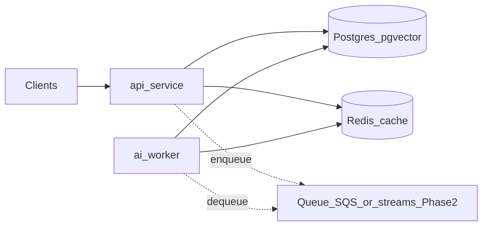

# Architecture — Phase 1 scaffolding

## Service boundaries

- **api-service** owns HTTP intake, request validation, orchestration, and authoritative writes to Postgres (Phase 2). Routes stay thin; services/repositories hold behavior.
- **ai-worker** owns embeddings, classification, retrieval, and suggestions (Phase 2). Operations must be **idempotent** under at-least-once delivery.
- **shared-contracts** holds cross-service DTOs, enums, and queue envelope types so HTTP and async jobs stay aligned.

## Data authority and cache

- **Postgres** is the **source of truth** for tickets, routing decisions, suggestions, embeddings metadata, and append-style audit events.
- **Redis** is **ephemeral** shared cache only. It must never be required to reconstruct authoritative state. Stale entries must be **invalidatable** when Postgres truth changes (Phase 2 cache layer behind `TicketCacheProtocol`).
- **pgvector** is assumed available in Postgres (`CREATE EXTENSION vector;` in local init). Embedding columns and indexes are deferred to Phase 2 migrations.

## Readiness semantics (`GET /ready`)

- **Postgres failure** → HTTP **503** (authoritative operations cannot proceed safely).
- **Redis failure** with healthy Postgres → HTTP **200** with `degraded: true` and `redis: false`. This matches “Redis failure causes degraded mode only” and avoids killing the API task solely for cache loss under ECS-style probes.

## Async processing and statuses

Ticket lifecycle values live in `shared_contracts.enums.TicketStatus`:

- `received`
- `pending_processing`
- `processing`
- `routed`
- `needs_human_review`
- `failed`

Phase 2 intake will enqueue work and move tickets to `pending_processing` quickly while the worker advances `processing` → terminal states. Historical outputs remain queryable for audit (immutable decision rows or event log — DDL in Phase 2).

## Failure-mode assumptions (preserved for later phases)

- **Postgres down:** reject authoritative operations; `/ready` is not OK.
- **Redis down:** degrade cache-backed features; `/ready` remains OK with `degraded: true`.
- **Worker crash:** jobs must be safe to **retry** (idempotent handlers + dedupe keys).
- **Duplicate submissions:** `Idempotency-Key` on `POST /tickets` (middleware stores value on `request.state.idempotency_key`); dedupe enforced in Phase 2 service/repository.
- **Stale cache:** explicit invalidation via cache protocol implementations in Phase 2.

## API contracts (Phase 1 route registration; handlers return 501)

- `POST /tickets` — create intake (optional `Idempotency-Key` header).
- `GET /tickets/{ticket_id}` — fetch ticket.
- `GET /tickets/{ticket_id}/routing` — latest routing decision.
- `GET /tickets/{ticket_id}/suggestion` — latest suggestion.
- `GET /tickets/{ticket_id}/similar` — similar ticket snapshot.
- `POST /tickets/{ticket_id}/reprocess` — enqueue re-run (idempotent job semantics in Phase 2).
- `GET /health` — liveness.
- `GET /ready` — Postgres + Redis probe with degraded semantics above.

## Observability (Phase 1 placeholders)

- Structured JSON logging via **structlog** with `X-Request-ID` correlation.
- `app/core/telemetry.py` is a stub; optional dependency group `observability` in `api-service` reserves OpenTelemetry APIs for Phase 2.
- `/metrics` is intentionally absent; document Prometheus wiring in a later phase.

## Queue abstraction

- **Local Compose** does not mandate a durable queue service. Production target is **AWS SQS** (or equivalent) fronting the worker; Redis Streams remain a dev-only option.
- API enqueue boundary: `TicketEnqueueProtocol` (`shared_contracts`). Worker consumption boundary: `JobQueue` protocol with `TicketProcessJob` payloads.

## Non-goals in Phase 1

No OpenAI calls, embedding models, vector queries, routing algorithms, auth, frontend, or retry engines—only scaffolding, contracts, connectivity, and topology.
