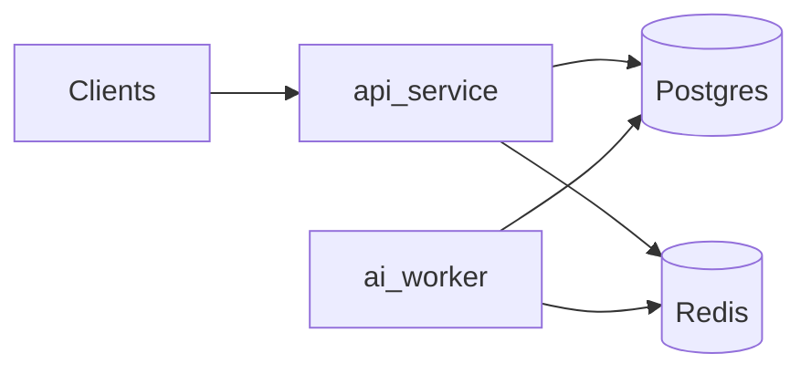

# Architecture — Phase 2 persistence

## Service boundaries

- **api-service** — FastAPI process: **SQLAlchemy async** sessions, **thin routes** (`/health`, `/ready`, ticket persistence), **repositories** own SQL/ORM access, **services** orchestrate multi-write flows (intake, embeddings, routing persistence, queries). Centralized **exception handlers** and **access logging** (structured JSON via structlog).
- **ai-worker** — Long-running process: startup **Postgres + Redis connectivity** (SQLAlchemy async + redis-py), then a **stub heartbeat loop** (no jobs, no queues in Phase 1).
- **shared-contracts** — **Neutral** Pydantic schemas only (`HealthResponse`, `ReadinessResponse`). No ticket, queue, or AI types in Phase 1.

## Data authority and cache

- **Postgres** is the **authoritative** store for tickets, embeddings, routing decisions, and audit events.
- **Redis** is **non-authoritative** (ephemeral). It is **not** used for ticket state, caching, or queues in Phase 2—readiness probe only.
- **pgvector** is enabled locally via `pgvector/pgvector:pg16`, init script under `docker/postgres/init/`, and Alembic `CREATE EXTENSION vector`. Embeddings live in `ticket_embeddings` (separate table); similarity search uses cosine distance on **active** rows only.

## Readiness semantics (`GET /ready`)

- **Postgres failure** → HTTP **503** with JSON body (`code: postgres_unavailable`, includes best-effort `redis` flag).
- **Redis failure** with healthy Postgres → HTTP **200** and `ReadinessResponse` with `degraded: true`, `redis: false` (cache loss must not fail readiness for authoritative intake later).

## HTTP surface (Phase 2)

- `GET /health` — liveness (`HealthResponse`).
- `GET /ready` — dependency readiness (`ReadinessResponse`).
- `POST /tickets` — create ticket (`pending_embedding`) + `ticket_received` audit event.
- `GET /tickets/{id}` — fetch ticket.
- `GET /tickets/{id}/status`, `/events`, `/routing-decision` — status, audit trail, latest routing.
- `POST /tickets/similar` — similarity search; **caller-provided embedding only** (no generation).
- `POST /tickets/{id}/embeddings/test` — local scaffolding to persist a provided vector.

## Failure-mode assumptions (forward-looking)

Later phases will add: idempotent workers, deduplicated ticket intake, cache invalidation, and auditability. Phase 1 does not implement these behaviors.

## Observability

- **structlog** JSON logs; `X-Request-ID` on requests/responses; `http.access` events from access middleware.
- `app/core/telemetry.py` remains a stub; optional `observability` extra in `api-service` for future OpenTelemetry.

## Migrations

- **Alembic** revision `phase2_ticket_persistence`: extension `vector`, tables `tickets`, `ticket_embeddings`, `routing_decisions`, `ticket_events`. Runtime services do not require Alembic in the default Docker image (`uv sync --frozen --no-dev`).

## Non-goals (Phase 2)

No AI provider calls, embedding generation, classifier, suggestions, routing **algorithm**, Redis caching/queues, worker job processing, auth, org/user models, frontend, or deployment automation.
