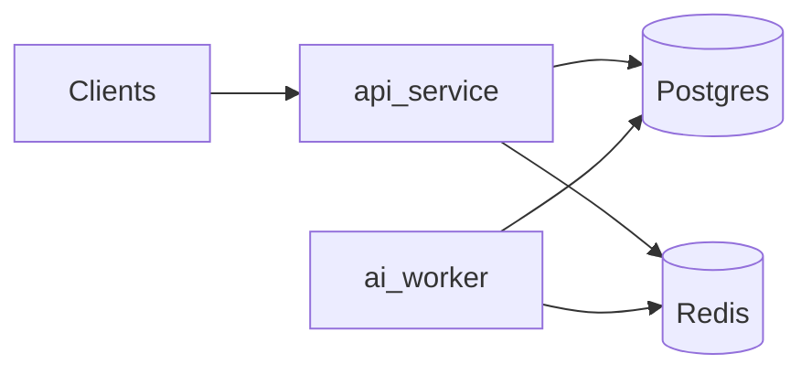

# Architecture — Phase 1 foundation

## Service boundaries

- **api-service** — FastAPI process: **SQLAlchemy async** sessions, **thin routes** (`/health`, `/ready`), **repositories** own SQL (e.g. `SELECT 1` probe), **services** compose probes without importing FastAPI. Centralized **exception handlers** and **access logging** (structured JSON via structlog).
- **ai-worker** — Long-running process: startup **Postgres + Redis connectivity** (SQLAlchemy async + redis-py), then a **stub heartbeat loop** (no jobs, no queues in Phase 1).
- **shared-contracts** — **Neutral** Pydantic schemas only (`HealthResponse`, `ReadinessResponse`). No ticket, queue, or AI types in Phase 1.

## Data authority and cache

- **Postgres** is the **authoritative** store for future application data (Phase 2+). Phase 1 only checks reachability.
- **Redis** is **non-authoritative** (ephemeral). It is **not** used for deduplication, queues, or ticket state in Phase 1—client wiring and readiness probe only.
- **pgvector** is optional in local Compose: the default stack uses official `postgres:16-bookworm` without the extension (Phase 1 only probes Postgres). When you need the extension locally, use the `pgvector/pgvector` image and the init script under `docker/postgres/init/` (see root README). No vector queries or ticket tables in Phase 1 migrations.

## Readiness semantics (`GET /ready`)

- **Postgres failure** → HTTP **503** with JSON body (`code: postgres_unavailable`, includes best-effort `redis` flag).
- **Redis failure** with healthy Postgres → HTTP **200** and `ReadinessResponse` with `degraded: true`, `redis: false` (cache loss must not fail readiness for authoritative intake later).

## HTTP surface (Phase 1)

- `GET /health` — liveness (`HealthResponse`).
- `GET /ready` — dependency readiness (`ReadinessResponse`).

## Failure-mode assumptions (forward-looking)

Later phases will add: idempotent workers, deduplicated ticket intake, cache invalidation, and auditability. Phase 1 does not implement these behaviors.

## Observability

- **structlog** JSON logs; `X-Request-ID` on requests/responses; `http.access` events from access middleware.
- `app/core/telemetry.py` remains a stub; optional `observability` extra in `api-service` for future OpenTelemetry.

## Migrations

- **Alembic** is configured with a **no-op** placeholder revision. Runtime services do not require Alembic packages in the default Docker image (`uv sync --frozen --no-dev`).

## Non-goals (Phase 1)

No ticket intake, classification, embeddings, vector search, suggestions, routing, reprocessing, caching semantics, Redis-backed queues, or AWS/ECS deployment automation in this phase.
